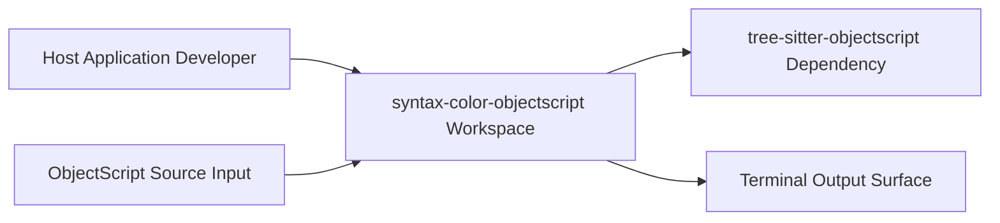
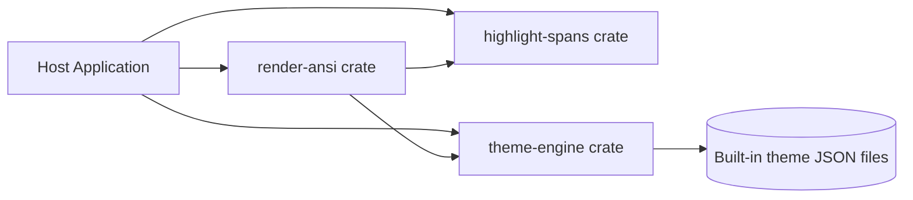
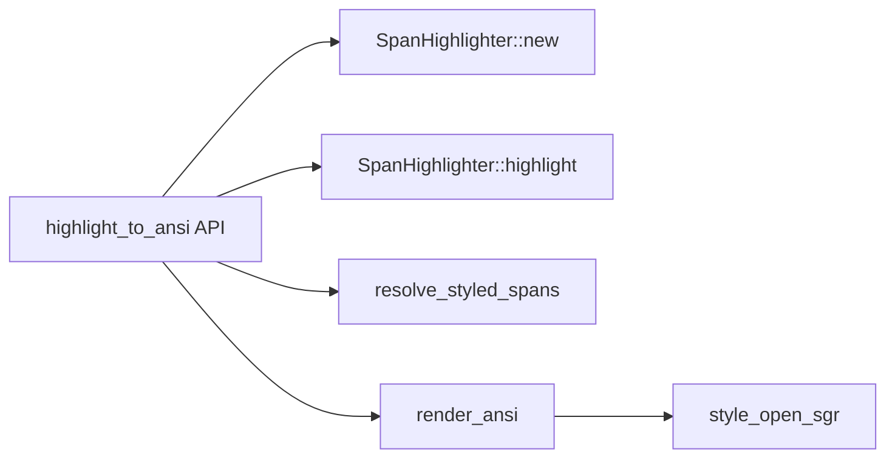
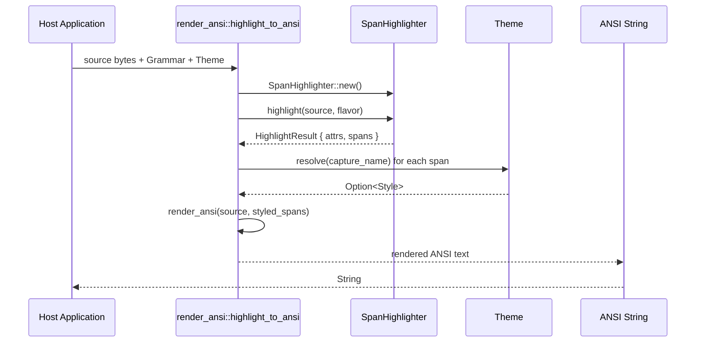

# C4 Model: syntax-color-objectscript (Repo Scope)

## C1: System Context

The workspace is consumed as a library from a host application, not as a standalone executable. Input is ObjectScript source text, and output is style-bearing spans or rendered ANSI text that an external terminal surface can display. Parsing and capture extraction depend on the external `tree-sitter-objectscript` package.

Evidence
- `crates/highlight-spans/Cargo.toml:12`
- `crates/highlight-spans/src/lib.rs:43`
- `crates/render-ansi/src/lib.rs:118`

Assumptions
- The output surface is modeled as an external actor because this repository only returns strings/lines and does not own terminal lifecycle.

## C2: Container Diagram

The repository is a Rust workspace with three member crates: `highlight-spans`, `theme-engine`, and `render-ansi`. `render-ansi` composes the other two crates to perform end-to-end highlighting and ANSI rendering. `theme-engine` embeds built-in themes from JSON files at compile time.

Evidence
- `Cargo.toml:2`
- `crates/render-ansi/Cargo.toml:9`
- `crates/render-ansi/Cargo.toml:10`
- `crates/theme-engine/src/lib.rs:45`

Assumptions
- Host applications may call `highlight-spans` and `theme-engine` directly even when `render-ansi` is present.

## C3: Component Diagram (`render-ansi`)

Inside `render-ansi`, `highlight_to_ansi` is the orchestration entrypoint. It builds or receives a highlighter, requests semantic spans from `highlight-spans`, resolves capture names to styles through `theme-engine`, then renders styled byte ranges into ANSI text. ANSI opening sequences are produced only when style attributes exist.

Evidence
- `crates/render-ansi/src/lib.rs:118`
- `crates/render-ansi/src/lib.rs:123`
- `crates/render-ansi/src/lib.rs:133`
- `crates/render-ansi/src/lib.rs:134`
- `crates/render-ansi/src/lib.rs:135`
- `crates/render-ansi/src/lib.rs:178`

Assumptions
- This component diagram focuses on the highest-traffic API (`highlight_to_ansi`) rather than every public helper.

Incremental update note (March 2026):
- `IncrementalRenderer` now supports explicit origin offsets for terminal patch placement (`crates/render-ansi/src/lib.rs:70`).
- Incremental diff/CUP columns are computed from grapheme display width (`crates/render-ansi/src/lib.rs:421`, `crates/render-ansi/src/lib.rs:497`, `crates/render-ansi/src/lib.rs:531`).
- Bridge CLI supports origin flags (`--origin-row`, `--origin-col`) (`crates/render-ansi/examples/vt_patch_bridge.rs:131`, `crates/render-ansi/examples/vt_patch_bridge.rs:173`).

## Dynamic Flow / Sequence (Critical Path)

The critical runtime path starts from `highlight_to_ansi`, which delegates syntax classification to `SpanHighlighter::highlight`. Each span's capture name is resolved through `Theme::resolve`, including dotted fallback to parent keys and then `normal` fallback. The renderer validates span ordering and bounds before emitting ANSI escape sequences and reset codes around styled segments.

Evidence
- `crates/render-ansi/src/lib.rs:118`
- `crates/render-ansi/src/lib.rs:133`
- `crates/render-ansi/src/lib.rs:134`
- `crates/theme-engine/src/lib.rs:117`
- `crates/theme-engine/src/lib.rs:125`
- `crates/theme-engine/src/lib.rs:131`
- `crates/render-ansi/src/lib.rs:217`
- `crates/render-ansi/src/lib.rs:168`
- `crates/render-ansi/src/lib.rs:171`

Assumptions
- Sequence omits `highlight_to_ansi_with_highlighter` because behavior is equivalent after highlighter provisioning.

## Deployment View

Not applicable.

This repository defines library crates and tests, but no in-repo service process model, container spec, or multi-node topology.

Evidence
- `Cargo.toml:1`
- `crates/highlight-spans/Cargo.toml:1`
- `crates/render-ansi/Cargo.toml:1`
- `crates/theme-engine/Cargo.toml:1`

## Assumptions

- Consumers integrate these crates into their own process/runtime and output device.
- The primary critical path is source -> highlight spans -> theme resolution -> ANSI render.

## Open Questions

- Should a non-ANSI renderer crate (for native C painter output) be part of this workspace or remain downstream?
- Is `render-ansi` expected to preserve existing terminal attributes outside emitted spans (beyond reset-based behavior)?

## Evidence

- `Cargo.toml:1`
- `Cargo.toml:2`
- `crates/highlight-spans/Cargo.toml:12`
- `crates/highlight-spans/src/lib.rs:43`
- `crates/highlight-spans/src/lib.rs:63`
- `crates/render-ansi/Cargo.toml:9`
- `crates/render-ansi/Cargo.toml:10`
- `crates/render-ansi/src/lib.rs:118`
- `crates/render-ansi/src/lib.rs:133`
- `crates/render-ansi/src/lib.rs:134`
- `crates/render-ansi/src/lib.rs:135`
- `crates/render-ansi/src/lib.rs:168`
- `crates/render-ansi/src/lib.rs:171`
- `crates/render-ansi/src/lib.rs:217`
- `crates/render-ansi/src/lib.rs:421`
- `crates/render-ansi/src/lib.rs:497`
- `crates/render-ansi/src/lib.rs:531`
- `crates/render-ansi/examples/vt_patch_bridge.rs:131`
- `crates/render-ansi/examples/vt_patch_bridge.rs:173`
- `crates/theme-engine/src/lib.rs:45`
- `crates/theme-engine/src/lib.rs:117`
- `crates/theme-engine/src/lib.rs:131`
