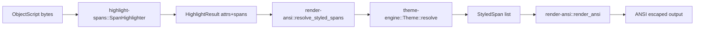

# Design Doc: syntax-color-objectscript (Repo Scope)

## Problem

ObjectScript highlighting needs semantic parsing, style selection, and output formatting, but coupling these concerns makes maintenance harder when grammars, themes, or render targets change independently (`Cargo.toml:2`, `crates/render-ansi/Cargo.toml:9`, `crates/render-ansi/Cargo.toml:10`).
The repository addresses this by isolating syntax extraction (`highlight-spans`), style resolution (`theme-engine`), and ANSI adapter behavior (`render-ansi`) (`crates/highlight-spans/src/lib.rs:63`, `crates/theme-engine/src/lib.rs:117`, `crates/render-ansi/src/lib.rs:53`).

## Goals

- Provide reusable syntax highlighting spans with stable attr IDs and byte ranges (`crates/highlight-spans/src/lib.rs:23`, `crates/highlight-spans/src/lib.rs:30`).
- Provide normalized capture-name style lookup with fallback (`crates/theme-engine/src/lib.rs:117`, `crates/theme-engine/src/lib.rs:125`, `crates/theme-engine/src/lib.rs:193`).
- Provide ANSI rendering APIs for full buffers and per-line output (`crates/render-ansi/src/lib.rs:53`, `crates/render-ansi/src/lib.rs:77`).
- Keep error surfaces explicit with typed error enums (`crates/highlight-spans/src/lib.rs:36`, `crates/theme-engine/src/lib.rs:164`, `crates/render-ansi/src/lib.rs:14`).

## Non-Goals

- Building and shipping a standalone CLI binary (no binary targets are defined in workspace manifests: `Cargo.toml:1`, `crates/render-ansi/Cargo.toml:1`).
- Supporting non-ANSI output adapters inside this repository (`crates/render-ansi/src/lib.rs:53`).
- Owning terminal session state outside produced strings (`crates/render-ansi/src/lib.rs:5`, `crates/render-ansi/src/lib.rs:171`).

## Current Behavior

`SpanHighlighter` builds the ObjectScript `HighlightConfiguration` and emits merged spans keyed by attr IDs (`crates/highlight-spans/src/lib.rs:49`, `crates/highlight-spans/src/lib.rs:72`, `crates/highlight-spans/src/lib.rs:142`).
`Theme` normalizes capture names, resolves dotted fallback chains, and loads built-in JSON themes via `include_str!` (`crates/theme-engine/src/lib.rs:117`, `crates/theme-engine/src/lib.rs:125`, `crates/theme-engine/src/lib.rs:45`, `crates/theme-engine/src/lib.rs:193`).
`render-ansi` validates span ranges, maps spans to styles, and emits SGR open/reset sequences around each styled segment (`crates/render-ansi/src/lib.rs:32`, `crates/render-ansi/src/lib.rs:54`, `crates/render-ansi/src/lib.rs:163`, `crates/render-ansi/src/lib.rs:217`).

## Proposal

Keep the existing three-layer architecture as the baseline integration contract and document it as the canonical workspace flow. Add formal repo-level docs that define boundaries, key structures, and dynamic path to reduce onboarding and prevent drift between crates.

This proposal preserves API behavior while clarifying module contracts:
- `highlight-spans` owns semantic capture extraction.
- `theme-engine` owns capture normalization and style fallback.
- `render-ansi` owns span validation and terminal encoding.

## Tradeoffs

Benefits:
- Better modularity and easier testing of each stage (`crates/highlight-spans/src/lib.rs:157`, `crates/theme-engine/src/lib.rs:199`, `crates/render-ansi/src/lib.rs:238`).
- Reuse of parsing and theming for future non-ANSI adapters (`Cargo.toml:2`).

Costs:
- Extra object conversions (`HighlightResult` -> `StyledSpan`) add intermediate allocations (`crates/render-ansi/src/lib.rs:36`).
- Reset-after-segment behavior may produce verbose escape output for dense span sets (`crates/render-ansi/src/lib.rs:171`).

## Validation Plan

- Keep unit tests that assert parser capture behavior, theme fallback behavior, and ANSI rendering correctness (`crates/highlight-spans/src/lib.rs:161`, `crates/theme-engine/src/lib.rs:213`, `crates/render-ansi/src/lib.rs:248`).
- Add doc maintenance checks by requiring evidence-backed citations for architecture claims (implemented in this documentation set).
- Run `cargo test` in workspace after documentation updates to ensure referenced behavior remains true (`README.md:121`).

## Risks

- If Tree-sitter capture names change upstream, themes can silently miss styles and rely on `normal` fallback (`crates/theme-engine/src/lib.rs:131`, `crates/highlight-spans/src/lib.rs:72`).
- Byte-based spans require consumers to keep source buffers unchanged between highlight and render phases (`crates/highlight-spans/src/lib.rs:25`, `crates/render-ansi/src/lib.rs:64`).

## Alternatives

- Monolithic single crate combining parse/theme/render: rejected because it increases coupling and reduces reusability across output targets (`Cargo.toml:2`).
- Theme resolution directly in `highlight-spans`: rejected because it would force parser crate to own style concerns (`crates/highlight-spans/src/lib.rs:30`, `crates/theme-engine/src/lib.rs:82`).

## Assumptions

- Downstream consumers want reusable libraries more than an end-user executable.
- ANSI output is the first adapter, not the final set of render targets.

## Open Questions

- Should theme aliases be extensible at runtime beyond current hard-coded names?
- Should renderer provide an optimization mode that minimizes redundant SGR resets?

## Evidence

- `Cargo.toml:1`
- `Cargo.toml:2`
- `README.md:121`
- `crates/highlight-spans/src/lib.rs:23`
- `crates/highlight-spans/src/lib.rs:25`
- `crates/highlight-spans/src/lib.rs:30`
- `crates/highlight-spans/src/lib.rs:36`
- `crates/highlight-spans/src/lib.rs:49`
- `crates/highlight-spans/src/lib.rs:63`
- `crates/highlight-spans/src/lib.rs:72`
- `crates/highlight-spans/src/lib.rs:142`
- `crates/highlight-spans/src/lib.rs:157`
- `crates/highlight-spans/src/lib.rs:161`
- `crates/theme-engine/src/lib.rs:45`
- `crates/theme-engine/src/lib.rs:82`
- `crates/theme-engine/src/lib.rs:117`
- `crates/theme-engine/src/lib.rs:125`
- `crates/theme-engine/src/lib.rs:131`
- `crates/theme-engine/src/lib.rs:164`
- `crates/theme-engine/src/lib.rs:193`
- `crates/theme-engine/src/lib.rs:199`
- `crates/theme-engine/src/lib.rs:213`
- `crates/render-ansi/Cargo.toml:1`
- `crates/render-ansi/Cargo.toml:9`
- `crates/render-ansi/Cargo.toml:10`
- `crates/render-ansi/src/lib.rs:5`
- `crates/render-ansi/src/lib.rs:14`
- `crates/render-ansi/src/lib.rs:32`
- `crates/render-ansi/src/lib.rs:36`
- `crates/render-ansi/src/lib.rs:53`
- `crates/render-ansi/src/lib.rs:54`
- `crates/render-ansi/src/lib.rs:64`
- `crates/render-ansi/src/lib.rs:77`
- `crates/render-ansi/src/lib.rs:118`
- `crates/render-ansi/src/lib.rs:163`
- `crates/render-ansi/src/lib.rs:171`
- `crates/render-ansi/src/lib.rs:217`
- `crates/render-ansi/src/lib.rs:238`
- `crates/render-ansi/src/lib.rs:248`
